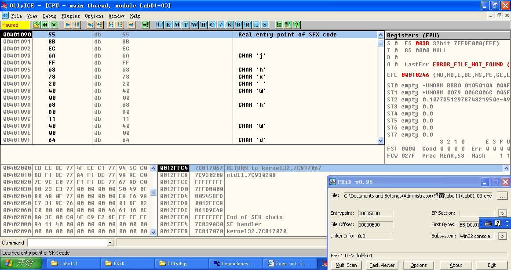

### requirement
+ ollydbg
+ PEID

### step
#### the packed file

  We can find that the file is packed by FSG
we need to find the OEP(original entry point) inorder to unpack it with PEID
#### use ollydbg found OEP
following the step below  

 

 

 
Then we can find the OEP is 00401090(colored by black)
#### unpacked the file with peid
following the step below  

 

 
now we unpacking the file and can verify the result below
#### verify result
open the unpacked file with peid 

 
On PEIDm, we can find the compiler of this file is vc6, not fsg again