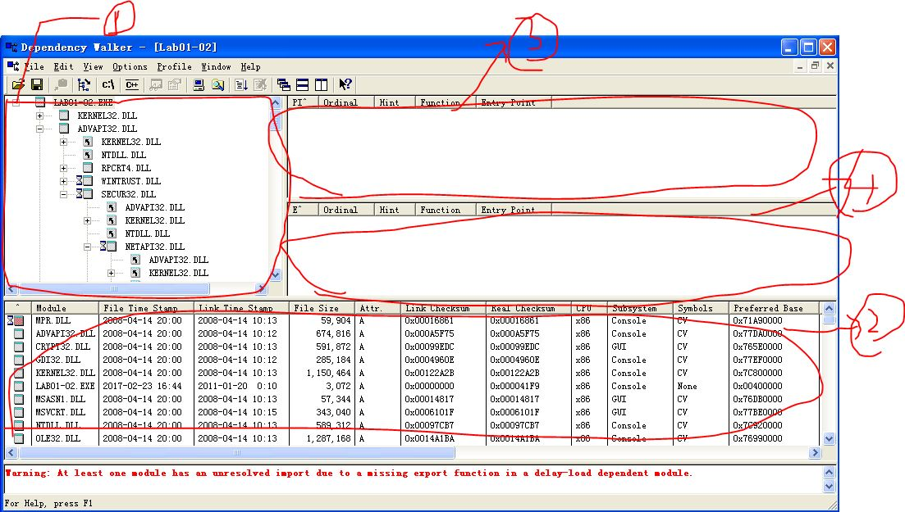

### MainFrame of DP

### Brief intro to MainFram
#### mark1 Module Dependency Tree View
The module Dependency Tree View displays a hierachical view of all the modules' dependency. DP starts with the root module you chose to open , and scan its import table to build its child that is a list of required dependent modules.
#### mark2 Module list View
The Module list view displays all of unqiue modules that dependencies for the root module you opened. The list defines the set of the files for the module to load and execute as a running process.
It can not happen the duplicate module there as the Module Dependency Tree View where frequently imported modules usually do.
#### mark3 Parent Import Function List View
The parent Import Function List View displays the list of parent import functions for the currently selected module in the Module Dependency Tree View.
#### mark4 Export Function List View
This View displays the functions exported by the currently selected module in the Module Dependency Tree
#### noted
all the information can be get from the helper