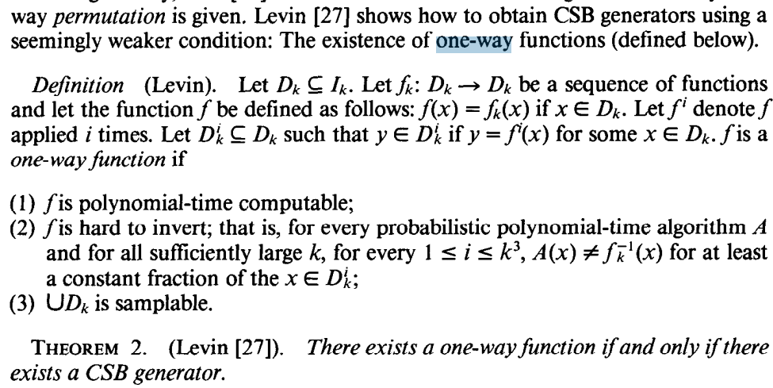
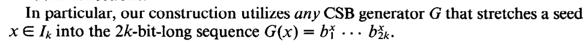
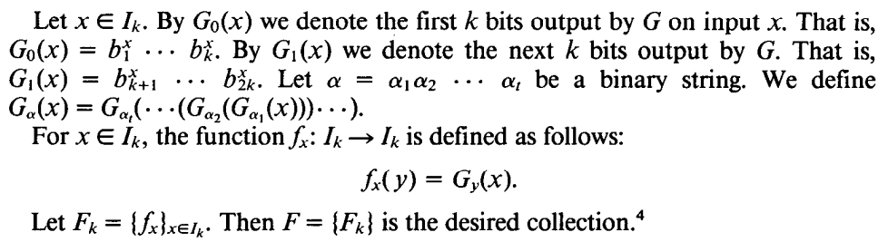
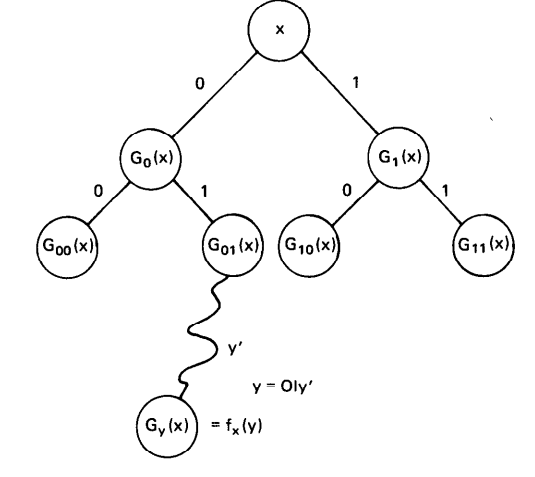

## Topic
We want to recall there a method constructing Poly-Random Collections from any one-way function.
## Background Ideas
### Poly-random
For strings. There is a properly set S, if programs that run in polynomial time lead to identical results when fed either with elements randomly selected in S or with elements randomly selected in the set of all strings.(set of strings can be specificed at fixed k-bits)
For functions. Almostly the same idea. While function need be fed with parameter to mapping. The programs run in polynomial time asking for the values of the function at arguments it choice cannot distinguish it from independent coin flips.
### Poly-random collection
F = {fk} where fk: Ik -> Ik
#### the property of auther's poly-random collection constructon
+   indexing
+   poly-time evaluation
+   poly-randomness

### GSB generators
GSB is a deterministic poly(k)-time that stretches a k-bit-long randomly selected seed into a P(k)-bit-long sequence that passes all next-bit-tests.
### One-way functions
easy to compute while hard to invert. Notice that, hard to invert means unpredictable of the inverted value while this does not always means randomness.
The following definition and theorem are very important. They construct a GSB from any one way function. By applying one way function iteratively i times, it choose a "approriate" set. Recall that the approriate set is poly-randomness.

## GGM construction

 

## WARNING
the proven part and how to test the randomness of string and function are very excellent contents while not present there. Also, the notation can be easily found in oral paper.